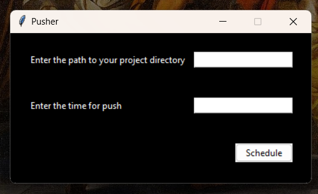

# Git Push Scheduler GUI Tool

This GUI tool is built with Python and Tkinter, allowing users to schedule a Git push operation at a desired time on the day. It utilizes the `python-crontab` library for scheduling cron jobs.

## Features

- User-friendly interface built with Tkinter.
- Schedule Git push operations for a specific time on the current day.
- Easy-to-use scheduling interface.

## Tech Stack

- Python
- Tkinter
- python-crontab

# NOTE : PROVIDE THE TIME IN 24 HOUR FORMAT AND JUST ENTER THE HOUR , THE PUSH WILL TAKE PLACE EXACTLY AT THE DESIRED HOUR AND 00 MINUTES, THE SUPPORT FOR CHOOSING MINUTES WILL BE ADDED LATER
# NOTE : ENTER FULL PATH TO YOU DIRECTORY WHERE GIT IS INITIALIZED
